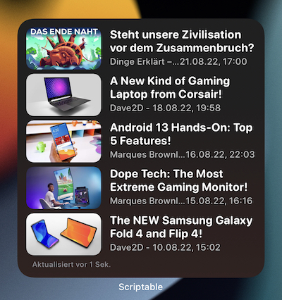

# YouTube Widget for Scriptable



Widget that displays the videos of a configured set of favorite channels in iOS and iPadOS home screen widgets via Scriptable.

### Features
* Fully chronological timeline of your favorite channels
* Opens clean embedded player in Safari with high video pre-selected
* Combine with your favorite YouTube Safari Extensions for the best viewing experience, for example [Pipifier](https://github.com/arnoappenzeller/PiPifier)

## How it works
This script is split into a data module, a table UI, and a widget UI. The data module will use the API Key to query the YouTube API for the channels you configured. Then it loads the main Uploads playlist for those channels and collects the latest videos, before putting it all together in a personalized feed that is displayed via the UI scripts.

## Requirements
* [Scriptable.app](https://scriptable.app) from the App Store
* A [YouTube Data API v3 Key](https://developers.google.com/youtube/v3/getting-started)
* iCloud enabled on your iOS devices (not tested with iCloud off)

## Installation
* Copy the scripts and Data folder to your Scriptable iCloud scripts folder
* Edit file at `Data/YouTubeFavorites.json`
    * Configure your favorite channels with the JSON format you can find below
* Set your YouTube Data v3 API Key as a key in Keychain accessible by Scriptable
    * E.g. via small script `Keychain.set("YouTubeDatav3", "YOURAPIKEY")` (substitute your API Key!)
* Test setup so far with opening the `YouTube Table` script, it should display a populated list after loading
* Add Scriptable widget to your Home Screen in a size you wish
* Edit the widget and set `YouTube Widget` as the source script

### Favorite Channels JSON Structure
Use the following JSON structure to configure all the YouTube channels you want to see the videos of in the feed of your widget.
```
{
    "channels": [
        {
            "channelId": "UCwRH985XgMYXQ6NxXDo8npw",
            "channelTitle": "Kurzgesagt"
        },
        ...
    ]
}
```

## FAQ
### How can I configure or add new favorite channels?
Given creating and editing a JSON file is not the best UX, the best way is to build a Siri Shortcut that can be invoked in a Share Sheet in Safari to add a channel you visited the channel page to. I will provide further instructions in a future update.

### How can I find a YouTube channel identifier?
The most straightforward way for me currently is to open the source code on a channel page and look for `<link rel="canonical" href="https://www.youtube.com/channel/CHANNELID">`, where `CHANNELID` is the identifier you want to copy. Since YouTube is a dynamically loading website, you might need to refresh the page before seeing this tag in the sources. As mentioned above, this can also be scripted into a neat Shortcut.

## Development & Customizations

### VS Code Tasks
Usually you will edit Scriptable scripts directly on your mobile device. If you want to make more advanced edits on a notebook or desktop, this repository includes a task for VSCode (macOS only) that copies the scripts to the expected Scriptable iCloud folder. This means you need to be logged in to the same iCloud account on the Mac you're editing on. After a short sync you can test your edits on your mobile devices.

### Data Module Logs
If you run the script `YouTube Data Module` within Scriptable it will log the currently favorited channel IDs.